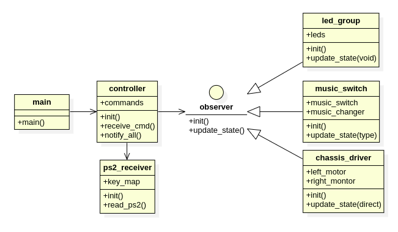

# RUCAR
    利用51单片机、L298N电机驱动、PS2手柄、音乐芯片、PWM控制模块、DIY灯组和小车底盘DIY实现的PS2摇控小车，并且可以用PS2控制的音乐播放和灯组。

## 功能说明
#### 遥控小车行驶
可通过PS2控制小车前进、后退、左转、右转。

#### 遥控音乐播放及切换
可通过PS2控制轩载音乐播放，音乐更换。

#### 遥控LED灯光效果切换
可通过PS2控制小车顶LED灯光开关和切换。
灯光效果可以有常亮、间隔闪烁等效果。

## 设计说明

#### 硬件设计

详细参照：[硬件设计说明](hardware/README.md)

#### 软件设计

详细参照：[软件设计说明和代码](software/README.md)

## PS2按键功能

| 按键     | 功能                         | 监控指示灯 |
| -------- | ---------------------------- | ---------- |
| 左侧上键 | 小车前进，长按有效，放开停止 | P0_0       |
| 左侧下键 | 小车后退，长按有效，放开停止 | P0_1       |
| 左侧左键 | 小车左转，长按有效，放开停止 | P0_2       |
| 左侧右键 | 小车右转，长按有效，放开停止 | P0_3       |
| 右侧上健 | 音乐开                       | P0_4       |
| 右侧下键 | 音乐关                       | P0_5       |
| 右侧左键 | 车顶灯开                     | P0_6       |
| 右侧右键 | 车顶灯关                     | P0_7       |
| 左侧1键  | 小车一直前进                 | P0_0       |
| 左侧2键  | 小车停止前进                 | P0_1       |
| 右侧1键  | 小车一直后退                 | P0_2       |
| 右侧2键  | 小车停止后退                 | P0_3       |

## 成品效果

敬请期待...

## 硬件模块及工具清单：

| 模块          | 说明                                                         | 价格(元) |
| ------------- | ------------------------------------------------------------ | -------- |
| 51单片机      | 单片机 STC89C52RC芯片，11.0592晶振。                         | 40       |
| 小车底盘      | 小车底盘及M3铜柱螺丝若干，底盘带4个直流电机。                | 30       |
| ps2手柄       | 无线的那种，会带接收器。                                     | 40       |
| L298N电机驱动 | 12V供电，同时带5V输出电压。                                  | 4        |
| 音乐芯片      | 需要手动焊接些喇叭                                           | 10       |
| PWM信号控制器 | 信号控制开关，一定要按他说明接线                             | 2        |
| DIY灯组       | DIY电路包括LED灯珠/电容/电阻/三极管/PCB板等                  | 10       |
| 电池及充电器  | 12V锂电池和12V充电器                                         | 35       |
| 各种接线      | 各种公对公，母对母杜邦线若干，DIY铜线，漆包线，转接头，接线器等 | 10       |

另外音乐芯片需要电烙铁，组装时可能需要万用表做些测试。以上东西都可以在网上买到。

## 使用的相关工具软件：

#### OS： Ubuntu 20.04

#### 硬件设计工具KiCAD

安装：https://docs.kicad.org/5.1/zh/getting_started_in_kicad/getting_started_in_kicad.html

#### 软件设计开发工具:

- 软件设计工具： StarUML  https://staruml.io/download

- 开发IDE： VSCODE

- 编译软件： sdcc/packihx, cmake

ubuntu下安装： sudo apt-get install sdcc

- 烧录软件：stcflash

ubuntu下安装： 从社区下载到本地，社区地址：https://github.com/laborer/stcflash

将stcflash.py文件解压到/usr/local/bin。 并去掉后缀名。

- 依赖： python3, python-pip3, python serial

安装python serial: https://www.geeksforgeeks.org/how-to-install-python-serial-package-on-linux/

如果执行: stcflash报错： usr/bin/env: ‘python’: No such file or directory

执行以下命令解决： sudo ln -s /usr/bin/python3 /usr/bin/python

- 串口调试工具： comtool

安装： sudo pipe3 install comtool

# 看到这里，说明你心动了，攒一个吧，不贵，硬件成本才200元左右。拼多多是个好东西，你想要的小器件都有，而且便宜还包邮。