## 整体设计

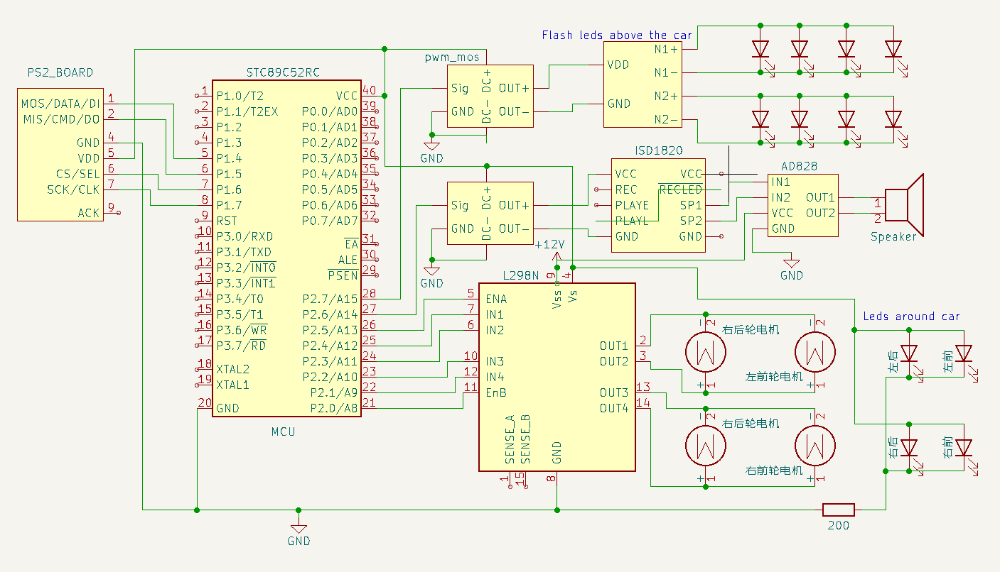

## 模块说明

#### 小车底盘
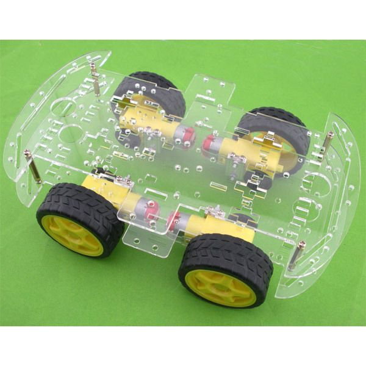

外购小车底盘带直流电机。

#### 控制模块
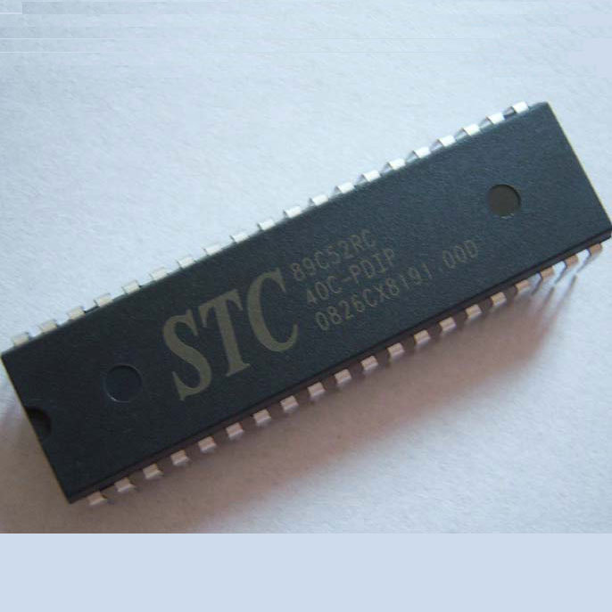

使用51单片机（STC89C52RC）作为控制中心，其中P0口控制LED灯，与自带LED灯反向； P2.0-P2.5 为电机控制口，P2.6-P2.7 控制音乐开关和更换。P1.4-P1.7为PS2通信口。
晶振频率：11.0592

| GPIO | 连接口                        | 初始值  | 说明        |
| ---- | ----------------------------- | ------- | ----------- |
| P2_0 | L298N_EnB 右轮使能            | 0       |             |
| P2_1 | L298N_IN4 右轮前进高电平      | 0       |             |
| P2_2 | L298N_IN3 右轮后退高电平      | 0       |             |
| P2_3 | L298N_EnA 左轮使能            | 0       |             |
| P2_4 | L298N_IN2 左轮前进高电平      | 0       |             |
| P2_5 | L298N_IN1 左轮后退高电平      | 0       |             |
| P2_6 | 音乐控制PWM正信号，高电平打开 | 0       | 音乐开关    |
| P2_7 | LED控制PWM正信号，高电平打开  | 0       | 车顶灯开关  |
| P1_4 | PS2_D1/DATA                   | default |             |
| P1_5 | PS2_D0/CMD                    | default |             |
| P1_6 | PS2_CS                        | default |             |
| P1_7 | PS2_CLK                       | default |             |
| P0_0 | 自带LED1                      | 1       | 1命令时点亮 |
| P0_1 | 自带LED2                      | 1       | 2命令时点亮 |
| P0_2 | 自带LED3                      | 1       | 3命令时点亮 |
| P0_3 | 自带LED4                      | 1       | 4命令时点亮 |
| P0_4 | 自带LED5                      | 1       | 5命令时点亮 |
| P0_5 | 自带LED6                      | 1       | 6命令时点亮 |
| P0_6 | 自带LED7                      | 1       | 7命令时点亮 |
| P0_7 | 自带LED8                      | 1       | 8命令时点亮 |

#### 电机驱动模块
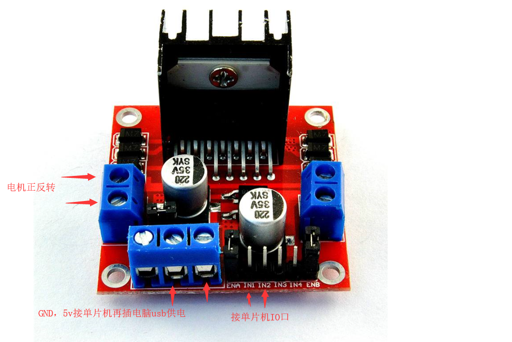

使用L298N电机驱动，左右轮分两组控制。分两组控制电机，左、右轮各用一组控制。

12V输入电压，5V输出电压为控制单板、音乐板、LED灯、PS2通信模块供电。

#### 遥控通信模块

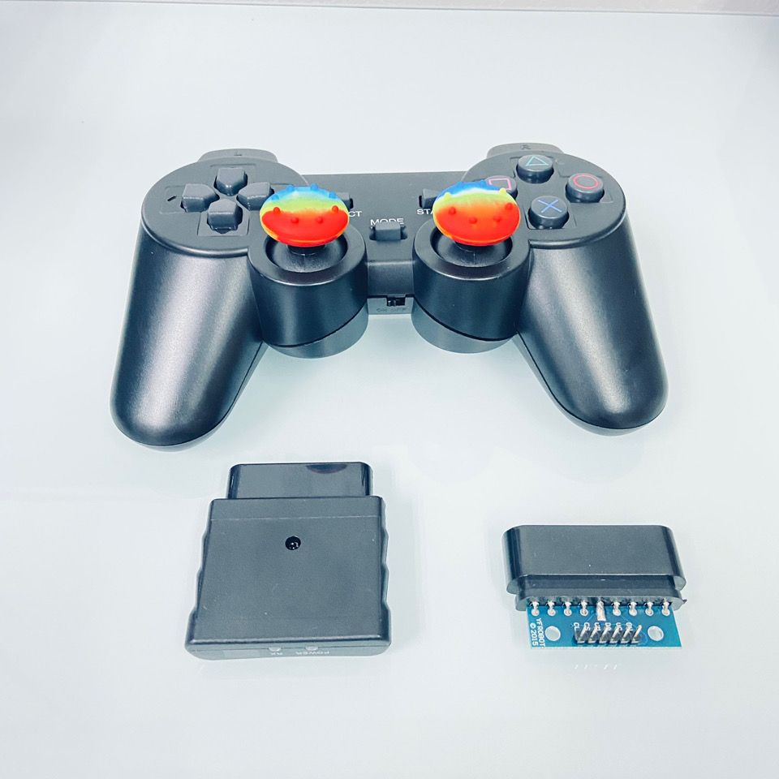

使用PS2通信模块进行遥控。控制键说明：

| 按键     | 功能                         | 控制端口     | 命令编码 | 监控灯 |
| -------- | ---------------------------- | ------------ | -------- | ------ |
| 左侧上键 | 小车前进，长按有效，轻型停止 | 电机驱动端口 | 1        | P0_0   |
| 左侧下键 | 小车后退，长按有效，轻型停止 | 电机驱动端口 | 2        | P0_1   |
| 左侧左键 | 小车左转，长按有效，轻型停止 | 电机驱动端口 | 3        | P0_2   |
| 左侧右键 | 小车右转，长按有效，轻型停止 | 电机驱动端口 | 4        | P0_3   |
| 右侧上健 | 音乐开                       | P2_6高电平   | 5        | P0_4   |
| 右侧下键 | 音乐关                       | P2_6低电平   | 6        | P0_5   |
| 右侧左键 | 车顶灯开                     | P2_7高电平   | 7        | P0_6   |
| 右侧右键 | 车顶灯关                     | P2_7低电平   | 8        | P0_7   |

#### 音乐模块

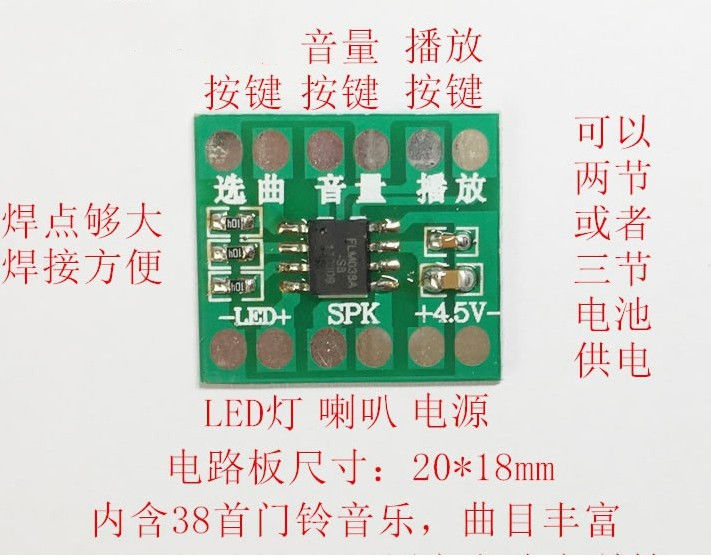

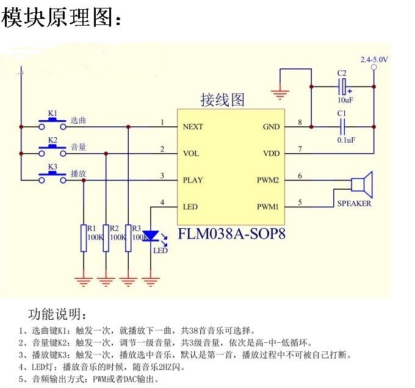

使用FLM038A-SOP8音乐芯片，通过P2_6, P2_7控制音乐开关和更换。 其中开关和更换使用两个PWM控制模块，如下图。都是高电平时开关打开。我这里不想做那么多控制，就直接PWM接电源控制，把左侧的各个控制焊死了。

#### PWM控制模块

配合音乐模块使用，实现音乐开关和切换。这玩意一定按示意图接，不能只开一路好像。

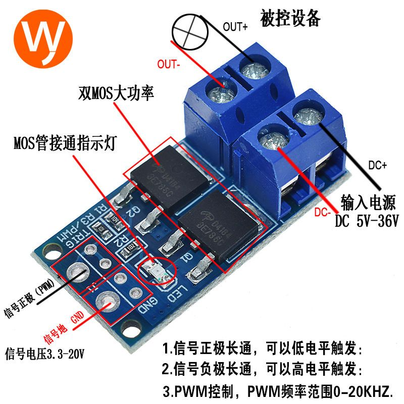

#### LED灯组模块

 两组灯，一组是车顶LED灯，用P1_2控制开关。 一组是车头灯（前后左右共4个），常亮。车顶灯使用驱动模块(如下图)，加PWM控制模块实现开关和闪烁。这里可以自己买块板子自己焊，想整什么样的就整什么样的。网上大把的教程。

灯光可以是下图的闪烁灯：

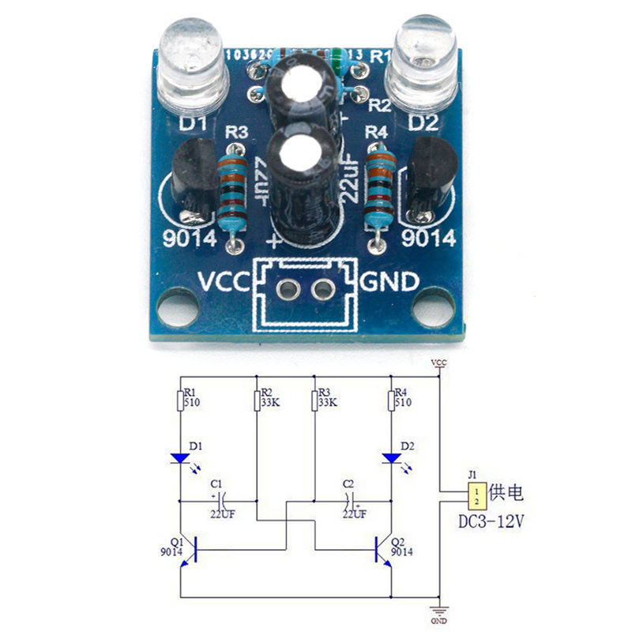

也可以是下图的流水灯：

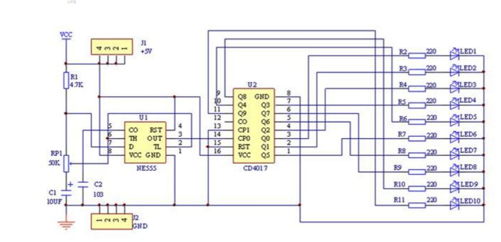

还可以是这样的：

也可以是下图的流水灯：

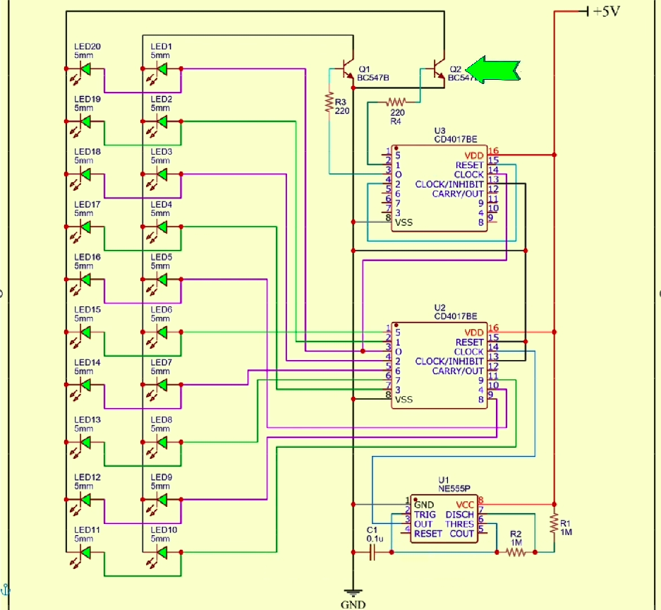

